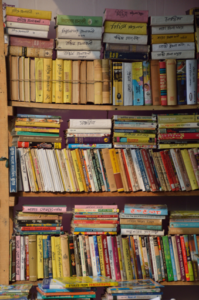
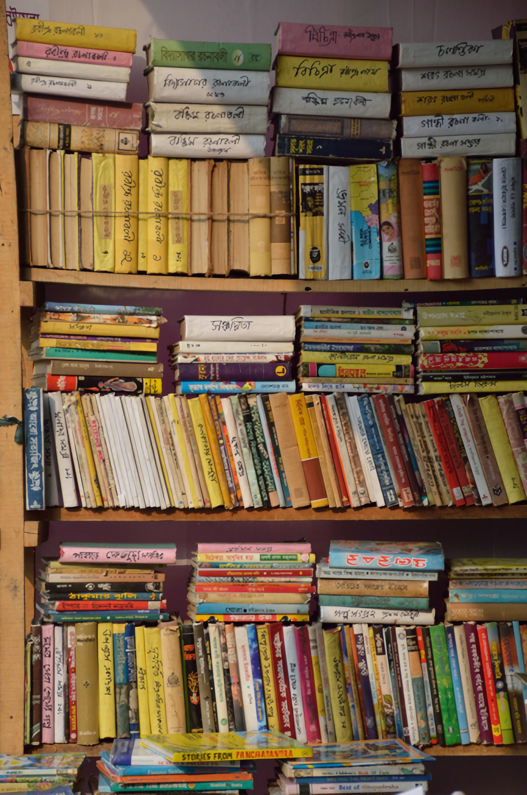
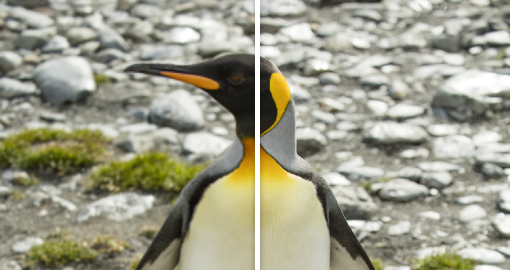
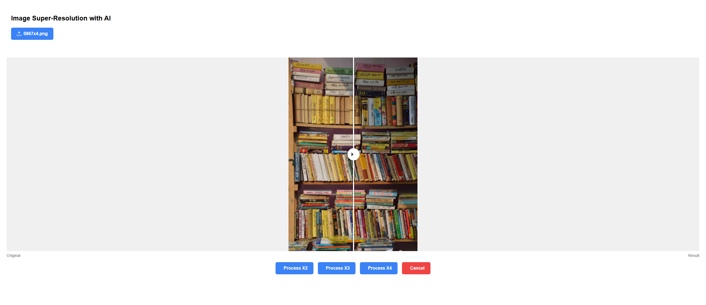
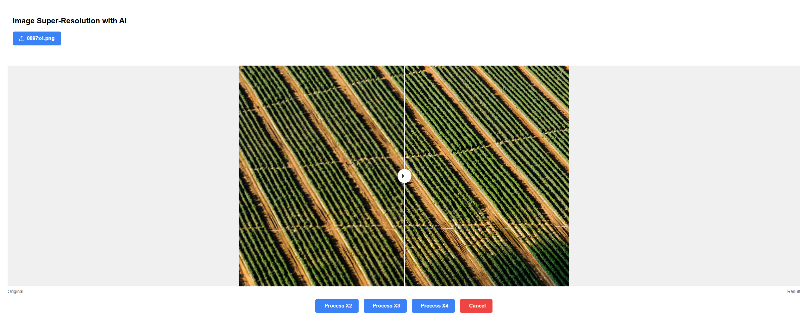

# ShowRoom — AI Image Super-Resolution

Web application for AI-powered image super-resolution using the [CRAFT-SR](https://github.com/AVC2-UESTC/CRAFT-SR) model.

## Technologies

### Backend

- **Python 3** + **Flask** — REST API server
- **PyTorch** — model inference
- **CRAFT-SR** — super-resolution model ([paper](https://github.com/AVC2-UESTC/CRAFT-SR))
- **OpenCV**, **Pillow** — image processing

### Frontend

- **Angular 17** — UI framework
- **PrimeNG** — UI component library
- **TypeScript** — type-safe development

## Screenshots

### Original vs. Super-Resolution Results

| Original                      | Result                      |
| ----------------------------- | --------------------------- |
|  |  |







## Installation

### 1. Clone the repository

```bash
git clone <repo-url>
cd Show
```

### 2. Backend — Python dependencies

```bash
cd IA
pip install -r requirements.txt
```

> Pretrained CRAFT-SR models are expected under `IA/experiments/pretrained_models/`.
> Download them from the [CRAFT-SR repository](https://github.com/AVC2-UESTC/CRAFT-SR).

### 3. Frontend — Node modules

```bash
cd UI/CRAFT-interface
npm install
```

## Usage

1. **Start the backend** (Flask API on port 5000):

   ```bash
   cd IA
   python app.py
   ```

2. **Start the frontend** (Angular dev server on port 4200):

   ```bash
   cd UI/CRAFT-interface
   ng serve
   ```

3. Open `http://localhost:4200` and upload an image. Choose a scale factor (x2, x3, x4) to upscale.
